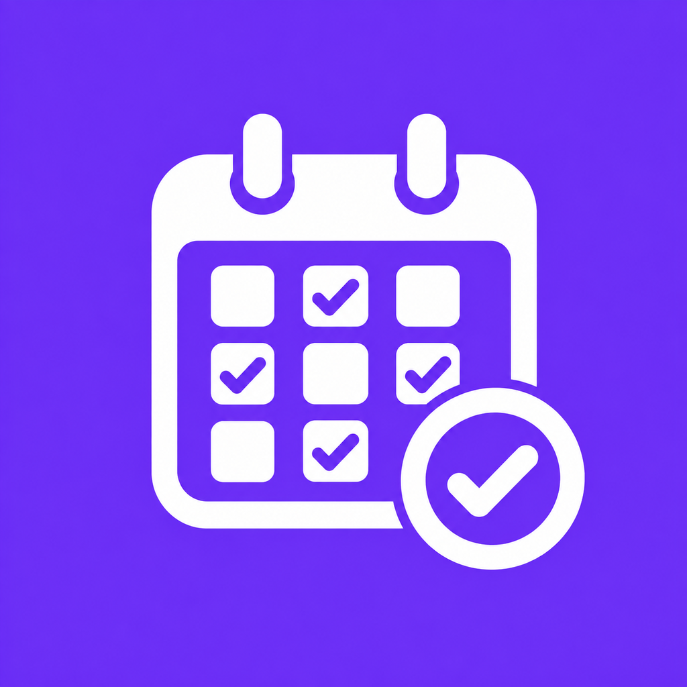

<p align="center">
  
</p>

<h1 align="center">Momentum</h1>

<p align="center">
  A beautiful, privacy-first habit &amp; routine tracker to help you build better habits — one day at a time.
</p>

<p align="center">
  
  
  
  
  
</p>

---

## Features

- **Habit management** — Create, edit, and delete habits with customizable icons, colors, and categories.
- **Flexible scheduling** — Daily, weekdays, weekends, or fully custom day-of-week schedules.
- **Streak tracking** — Automatic current and longest streak calculations to keep you motivated.
- **Calendar heatmap** — A 12-week "GitHub-style" heatmap showing your consistency at a glance, filterable per habit.
- **Analytics** — Completion rates, totals, and overview dashboards across 7 / 30 / 90-day ranges.
- **Daily reminders** — Optional local notifications for every habit.
- **Dark & light themes** — Plus three accent color themes: **Violet**, **Sunset**, and **Ocean**.
- **Private by design** — 100% offline. All data stays on your device.

## Screenshots

> Screenshots coming soon.

## Tech Stack

| Layer        | Technology                          |
| ------------ | ----------------------------------- |
| Framework    | Flutter 3.41                        |
| Language     | Dart 3.11                           |
| State Mgmt   | BLoC (flutter_bloc)                 |
| Persistence  | Hive (fast, local, no setup)        |
| Notifications| flutter_local_notifications        |
| Localization | intl                                |

## Getting Started

### Prerequisites

- [Flutter](https://docs.flutter.dev/get-started/install) 3.41 or later
- Dart 3.11 or later
- Android SDK 21+ (minSdk) / iOS 12+

### Run in debug mode

```bash
flutter pub get
flutter run
```

### Build a release APK

```bash
flutter build apk --release
```

The APK will be generated at:

```
build/app/outputs/flutter-apk/app-release.apk
```

## Architecture

Momentum follows a clean feature-first structure powered by **BLoC** for predictable, testable state management.

```
lib/
├── core/
│   ├── constants/     # Colors, spacing, theme types
│   ├── theme/         # Light & dark ThemeData
│   └── widgets/       # Shared widgets (logo, cards, rings)
├── features/
│   ├── onboarding/    # Splash & onboarding flow
│   ├── home/          # Dashboard, stats & habit list (HomeCubit)
│   ├── habit/         # Create / edit / details screens
│   ├── calendar/      # Heatmap & month summary (CalendarCubit)
│   ├── analytics/     # Progress dashboard (AnalyticsCubit)
│   ├── settings/      # Appearance, notifications & data (AppThemeCubit)
│   └── theme/         # Theme state management
├── models/            # Habit, HabitCompletion, UserSettings
└── services/          # Hive, notifications, streaks
```

## License

Released under the [MIT License](LICENSE).